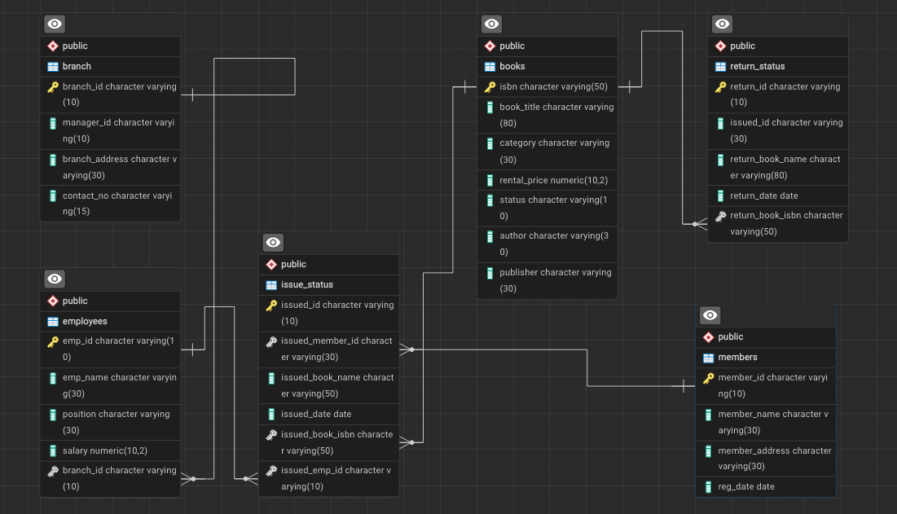

# Library Management System using SQL

## Project Overview

**Project Title**: Library Management System
**Level**: Intermediate
**Database**: `library_db`

This project demonstrates the implementation of a Library Management System using SQL. It covers database design, CRUD operations, CTAS (Create Table As Select), and advanced querying with stored procedures — built and organized to showcase practical SQL skills end to end.

## Objectives

1. **Set up the Library Management Database** — tables for branches, employees, members, books, issued status, and return status.
2. **CRUD Operations** — Create, Read, Update, and Delete records.
3. **CTAS** — generate new tables from query results.
4. **Advanced SQL Queries** — joins, aggregations, and stored procedures to solve real reporting problems.

## Entity Relationship Diagram



## Project Structure

```
library-management-sql/
├── README.md
├── data/                       # sample CSV data
│   ├── branch.csv
│   ├── employees.csv
│   ├── members.csv
│   ├── books.csv
│   ├── issued_status.csv
│   └── return_status.csv
├── sql/
│   ├── 01_schema.sql           # table creation + relationships
│   ├── 02_insert_data.sql      # load CSV data into the tables
│   ├── 03_crud_operations.sql  # Tasks 1-5: Create/Update/Delete/Read
│   ├── 04_ctas_queries.sql     # Tasks 6-12: CTAS + analysis queries
│   ├── 05_advanced_queries.sql # Tasks 13, 15-18, 20: advanced analysis
│   └── 06_stored_procedures.sql# Tasks 14 & 19: issue_book, add_return_records
└── assets/
    └── library_erd.png
```

## How to Use

1. **Clone the repository**

```bash
git clone https://github.com/<your-username>/library-management-sql.git
```

2. **Create the database** (PostgreSQL)

```sql
CREATE DATABASE library_db;
```

3. **Run the SQL files in order**

```bash
psql -d library_db -f sql/01_schema.sql
psql -d library_db -f sql/02_insert_data.sql
psql -d library_db -f sql/03_crud_operations.sql
psql -d library_db -f sql/04_ctas_queries.sql
psql -d library_db -f sql/05_advanced_queries.sql
psql -d library_db -f sql/06_stored_procedures.sql
```

4. **Explore and modify** — tweak the queries to ask your own questions of the data.

## Tasks Solved

| # | Task | File |
|---|------|------|
| 1 | Create a new book record | `03_crud_operations.sql` |
| 2 | Update a member's address | `03_crud_operations.sql` |
| 3 | Delete an issued record | `03_crud_operations.sql` |
| 4 | Books issued by a specific employee | `03_crud_operations.sql` |
| 5 | Members who issued more than one book | `03_crud_operations.sql` |
| 6 | CTAS — book issue counts | `04_ctas_queries.sql` |
| 7 | Books in a specific category | `04_ctas_queries.sql` |
| 8 | Total rental income by category | `04_ctas_queries.sql` |
| 9 | Members registered in the last 180 days | `04_ctas_queries.sql` |
| 10 | Employees with branch manager details | `04_ctas_queries.sql` |
| 11 | Books above a rental price threshold | `04_ctas_queries.sql` |
| 12 | Books not yet returned | `04_ctas_queries.sql` |
| 13 | Members with overdue books | `05_advanced_queries.sql` |
| 14 | Update book status on return (procedure) | `06_stored_procedures.sql` |
| 15 | Branch performance report | `05_advanced_queries.sql` |
| 16 | CTAS — active members (last 2 months) | `05_advanced_queries.sql` |
| 17 | Top 3 employees by books processed | `05_advanced_queries.sql` |
| 18 | Members issuing high-risk (damaged) books | `05_advanced_queries.sql` |
| 19 | Issue a book (procedure) | `06_stored_procedures.sql` |
| 20 | CTAS — overdue books and fines | `05_advanced_queries.sql` |

## Conclusion

This project shows how to design a relational schema, populate it, and use SQL — from basic CRUD to stored procedures — to answer real operational questions for a library system. It's a solid portfolio piece for demonstrating database design and querying skills.

## Author

Built as a personal SQL practice project, inspired by the **Library Management System** tutorial series by Zero Analyst.
